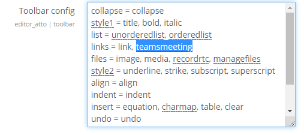
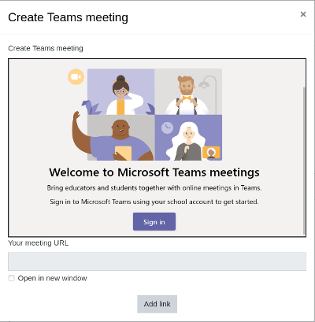
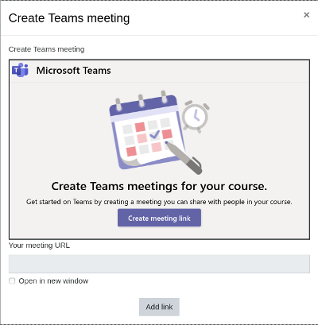
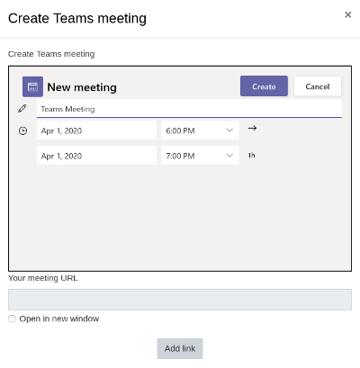
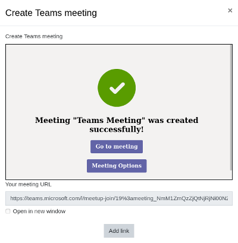
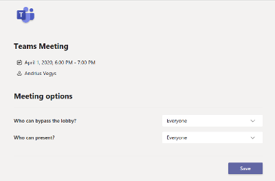

# An Atto plugin to create Microsoft Teams meeting and imports meeting link

## Description
[Microsoft Meetings application](https://github.com/OfficeDev/msteams-app-lms-meetings#frequently-asked-questions) integrated into Atto editor plugin which allows to create meeting and automatically add meeting link into Atto editor field content.

## Installation
* Download the plugin and extract into lib/editor/atto/plugins/teamsmeeting.
* Install like any other Moodle plugin (ie via visiting as admin <moodle_url>/admin/index.php?cache=1).
* Add an icon to atto editor in <moodle_url>/admin/settings.php?section=editorsettingsatto. Ie update "Toolbar config" line with "links" with "links = link, teamsmeeting".

## Usage Guide
1. When editing description using the Atto Editor, click on the Microsoft Teams  icon.

2. Then select  Create meeting link  (you will need to sign into your Microsoft Teams account the first time you use it).

3. Enter a meeting title, date, and time, then click Create.

4. The link will show in the field “Your meeting URL”. Mark “Open in a new window” if you want the meeting to open in a new tab and click “Add link” to finish.

5. To reach meeting options select the text with the meeting link that you have created before and click on the Microsoft Teams  icon in Atto Editor toolbar.

6. You will get to the same screen with two buttons - "Go to Meeting" and "Meeting Options". Click on the "Meeting Options" button and a new browser window will open with your meeting options.

**NOTICE:** Meeting options are only available for meetings that were created with Atto plugin v1.2 and later.

## Localization (available with Atto plugin v1.2 and later)
Atto Teams Meeting plugin also enables to use Meetings App locale feature. User language selected in Moodle is passed to Meetings App. At the moment Meetings app supported locales - 'ar', 'bg', 'cs', 'cy', 'da', 'de', 'en-us', 'en-gb', 'es', 'es-mx', 'fi', 'fr', 'fr-ca', 'he', 'is', 'it', 'ja', 'ko', 'nb', 'nl', 'no', 'nn-no', 'pl', 'pt-br', 'pt-pt', 'ru', 'sv', 'th', 'tr', 'zh-cn', 'zh-tw'.

Atto Teams Meeting plugin itself by default supports only 'en' locale. However, Moodle community is adding more translations for the plugin and you can add them yourself. [More details here](https://docs.moodle.org/dev/Translating_plugins).

## Hosting Meetings App (optional)
You can host Microsoft Meetings application yourself. To do this:
* Download Meetings App code prepared to work with Atto plugin from https://github.com/enovation/msteams-app-lms-meetings
* Follow instructions in README file to setup application.
* Change Meetings appllication url in Atto plugin settings to your new URL (<moodle_url>/admin/settings.php?section=atto_teamsmeeting_settings).

